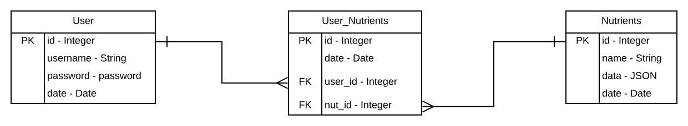

# foodtracker-app
School project that gets data from an API and allows people to work with this data.
https://foodtracker-app.herokuapp.com/

Plan a menu down to each calorie and nutrient. This app will let the user input menu ingredients with weight or measurement. 
The app will add up all the ingredients and chart the totals of each nutrient and calorie. 

The type of user that will benefit from this app is anyone that needs to know every component of a menu item. These include 
people who have a medical condition, people who are on a specific diet, and restaurateurs who are concerned about menu information.

This app will rely exclusively with USDA FoodData Central API as the source of data. It is a free data source, but they require 
developers to inform them on how the data is used. 

The app will allow a user to create an account and keep track of their diet over a period of time. User data will be saved in a 
PostgreSQL database. If a user chooses not to create an account, they can use the app but just won’t have the ability to save their data.

Technology stack used: Python, Javascript, HTML, CSS, Flask, Flask-Bcrypt, Flask-SQLAlchemy, Jinja2, WTForms.

